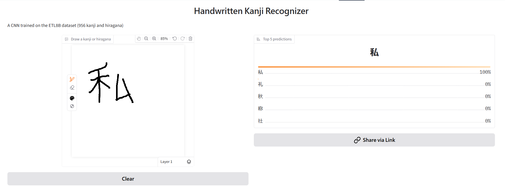

# Handwritten Kanji Recognizer

A convolutional neural network that recognizes handwritten Japanese characters covering 956 classes, including 881 common kanji and 75 hiragana. Draw a character and it shows its top 5 guesses.

**[Try the demo](https://huggingface.co/spaces/Eltrax/kanji-recognizer)** (click the brush icon, then draw one character)


 

## Results

 Test accuracy:  **96.5%** (29,697 / 30,784) 
 Classes:  956 
 Training: 10 epochs 

## How it works

**Dataset:** [ETL8B](http://etlcdb.db.aist.go.jp/) from AIST: about 154,000 handwritten samples from 1600 writers, stored as 63×64 black-and-white images.
Parsing the binary files, the information is then split 80/20 train and test respectively. 

**Model:**  CNN written in PyTorch:

```
Input 1×63×64
→ Conv 3×3, 32 filters → ReLU → MaxPool 2×2
→ Conv 3×3, 64 filters → ReLU → MaxPool 2×2
→ Conv 3×3, 128 filters → ReLU → MaxPool 2×2
→ Fully connected 512 → ReLU
→ Fully connected 956 (one output per character)
```

Trained via Adam (learning rate 0.001), cross-entropy loss, and batch size 128. 

**Making drawings match the training data.** Program converts the 400x400 canvas to a 63x64 scan in order to correctly match the input. 

## Run it yourself

Requires [uv](https://docs.astral.sh/uv/)

```
git clone https://github.com/Traelx/PyTorch_Test.git
cd PyTorch_Test
uv sync
uv run app.py
```

**To retrain:** 
Due to license, redistribution is not allowed, download at the [ETL Character Database](http://etlcdb.db.aist.go.jp/). Once files are in project folder, make sure to delete `model.pt` before running.


## Future Improvements Needed

**Test accuracy measured on familiar handwriting:** Due to the nature of the dataset, nearly every writer appears in both training and test sets. Therefore, the 96.5% accuracy only reflects handwriting the model has seen. 

**Limited Kanji:** The model only recognizes 956 characters, and drawing a character outside that set will cause it to confidently predict the closest match.  

This model is still heavily limited and will likely need future adjustments. However, it is still a useful tool to practise writing and memorizing kanji.

